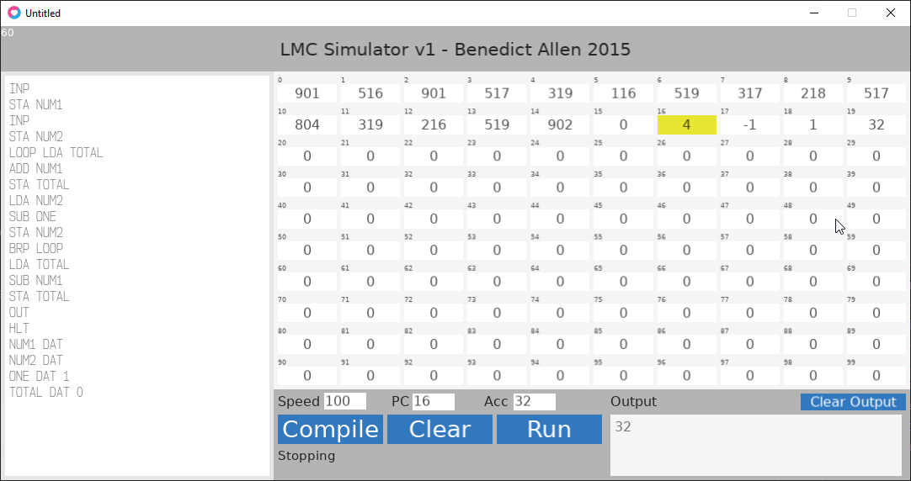

# LMC Simulator

LMC ([LittleManComputer](https://en.wikipedia.org/wiki/Little_man_computer)) is a simplified model of a computer, providing a small instruction set of 11 instructions which you can use to write functional programs.

This is a small implementation of LMC featuring an easy to use GUI that allows you to see the program in action.

Note, this uses the [Love2D](https://love2d.org/) game engine.



Check out the [releases](https://github.com/BenedictAllen/LMC-Simulator/releases) to have a go.

Example code to multiple two numbers:

```asm
INP
STA NUM1
INP 
STA NUM2
LOOP LDA TOTAL
ADD NUM1
STA TOTAL
LDA NUM2
SUB ONE
STA NUM2
BRP LOOP
LDA TOTAL
SUB NUM1
STA TOTAL
OUT
HLT
NUM1 DAT
NUM2 DAT
ONE DAT 1
TOTAL DAT 0
```
